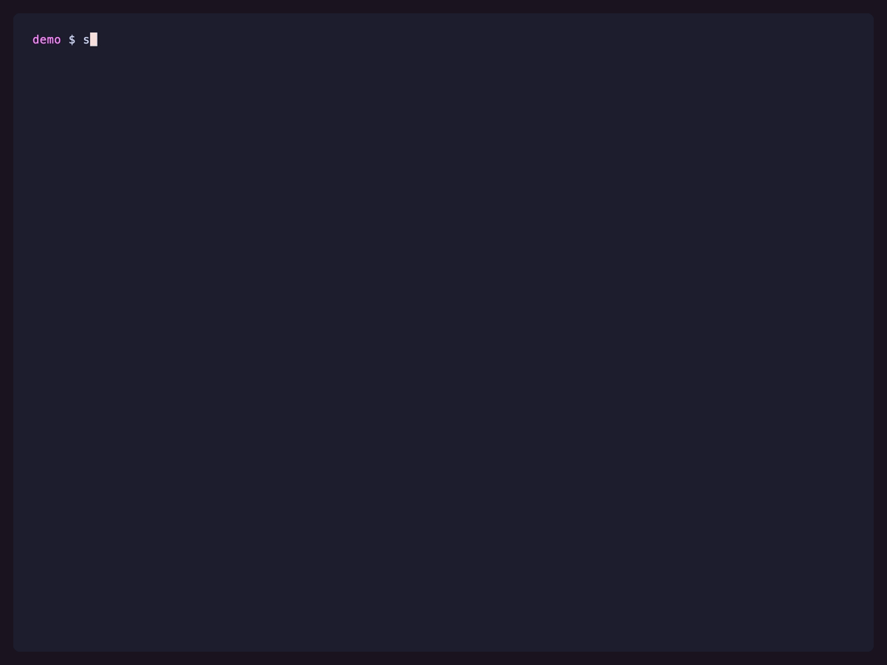
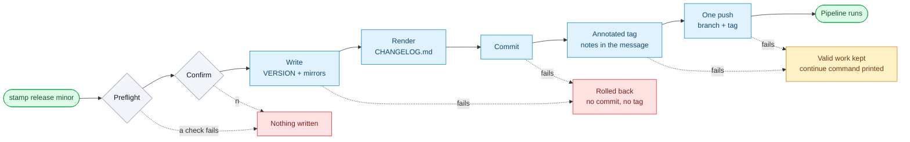

<div align="center">

<h1 align="center">stamp</h1>

**Cut the release on your machine. Let CI do the boring half.**

One command sets the version, writes it everywhere the project keeps it, checks git,
commits, tags, and pushes branch and tag together. The tag triggers your pipeline.

[](https://github.com/p-arndt/stamp/actions/workflows/ci.yml)
[](https://github.com/p-arndt/stamp/actions/workflows/release.yml)
[](go.mod)
[](#-install)
[](#configuration)

[Supported](#what-it-supports) · [Install](#-install) · [Quickstart](#-quickstart) · [Commands](#-commands) · [Pre-releases](#pre-releases) · [Changelog](#-changelog) · [How a release runs](#how-a-release-runs) · [Checks](#checks) · [Configuration](#configuration) · [Components](#-components) · [CI](#the-ci-side)

</div>

---

<p align="center">
  
</p>

<sub>Everything on screen is a real release of a throwaway repository. `VERSION` is the
source of truth, `package.json` follows it, and both are bumped in one commit. Built by
[demo/setup.sh](demo/setup.sh); re-record it with `just demo`.</sub>

## What it supports

| | |
| --- | --- |
| **Version locations** | A plain text file (`VERSION`) · a field in JSON, YAML or TOML, nested fields included |
| **Written as** | `VERSION` · `package.json#version` · `Chart.yaml#appVersion` · `pyproject.toml#project.version` |
| **Several at once** | Any number of locations per component, all bumped in the same commit |
| **Components** | Independently versioned units in one repository, each with its own files and its own tag |
| **Version formats** | Strict semver, including pre-releases (`1.0.0-beta.1`) and build metadata |
| **Bumps** | `patch` · `minor` · `major` · `final` · any explicit version |
| **Pre-releases** | `stamp prerelease minor` opens a `beta` series; a bare `stamp prerelease` walks it: `-beta.1`, `-beta.2`, … |
| **Changelog** | Entries written by hand as one file per change, rendered into `CHANGELOG.md` and the tag message by the release. Off until you use it |
| **Tag styles** | `v0.5.0`, `0.5.0`, `web-v0.5.0`, or whatever your template renders |
| **Detected without config** | `VERSION` file · `package.json`. `stamp init` looks wider, see [Configuration](#configuration) |
| **File formatting** | Preserved byte for byte apart from the version literal. Tabs stay tabs, key order stays put, comments survive, the diff is one line |
| **Platforms** | Windows · macOS · Linux, amd64 and arm64, static binaries |
| **Needs** | The `git` binary. Nothing else. |
| **Not supported** | Version literals in arbitrary source files (no regex rewriting) · releasing every component at once · running your tests |

## 📥 Install

macOS and Linux:

```bash
curl -fsSL https://raw.githubusercontent.com/p-arndt/stamp/main/install.sh | sh
```

Windows, in PowerShell 5.1 or 7+:

```powershell
irm https://raw.githubusercontent.com/p-arndt/stamp/main/install.ps1 | iex
```

Detects your platform, verifies the archive's SHA-256 against the release's checksums file,
installs only on a match. `wget -qO- … | sh` works too.

Pin a version, or install somewhere else:

```bash
curl -fsSL https://raw.githubusercontent.com/p-arndt/stamp/main/install.sh \
  | sh -s -- --version 0.2.0 --bin-dir ~/.local/bin
```

```powershell
& ([scriptblock]::Create((irm https://raw.githubusercontent.com/p-arndt/stamp/main/install.ps1))) -Version 0.2.0
```

| | Default | Environment variable |
| --- | --- | --- |
| Version | `latest` | `STAMP_VERSION` |
| Directory | `~/.local/bin`, and `%LOCALAPPDATA%\Programs\stamp` on Windows | `STAMP_BIN_DIR` |
| GitHub token | none, set one if your IP is rate-limited | `GITHUB_TOKEN` |

Flags beat the environment; `install.sh --help` lists them. The shell script prints an
`export PATH=…` line instead of editing your rc file; the PowerShell script writes the user
`PATH` unless you pass `-NoAddToPath`.

**By hand:** archive from the [latest release](https://github.com/p-arndt/stamp/releases/latest),
checked against `stamp_<version>_checksums.txt`, binary onto your `PATH`.

**From source,** with Go and [just](https://github.com/casey/just): `just install`.

### Staying current

`stamp self-update` swaps the running binary for the latest release, once the checksum
verifies. `stamp check-update` looks without upgrading.

A successful command hints on **stderr** when a newer version exists, at most once a day.
`STAMP_NO_UPDATE_CHECK=1` silences it; source builds report as `dev` and never check.

## 🚀 Quickstart

With a `VERSION` file or a `package.json` there is nothing to set up:

```console
$ stamp current                   # what is committed right now
0.4.0

$ stamp release minor --dry-run   # the plan and every check, nothing written
$ stamp release minor             # the real thing, after one confirmation
```

That writes `0.5.0` everywhere, commits, tags `v0.5.0`, pushes both. You supply the CI job
that reacts to the tag.

`stamp init` writes a `.stamp.yml` to edit if a default is wrong. A monorepo with separately
versioned packages is what [Components](#-components) is for.

## 📟 Commands

| Command | What it does |
| --- | --- |
| `stamp init` | Ask a few questions, then write a `.stamp.yml` describing this repository. Optional; stamp works without one. |
| `stamp release [component] <patch\|minor\|major\|final\|x.y.z>` | The whole release: resolve, check, write, commit, tag, push. `final` promotes a pre-release to the release it was for, dropping the pre-release and bumping nothing. |
| `stamp prerelease [component] [patch\|minor\|major]` | The same, cut as a pre-release: `1.2.3` → `1.3.0-beta.1`. Bare, it cuts the next candidate of the series already running. Abbreviates to `stamp pre`. |
| `stamp set [component] <patch\|minor\|major\|final\|x.y.z>` | Write the version files only, no git. May also go backwards. It is the correction command. |
| `stamp note [component] <added\|changed\|deprecated\|removed\|fixed\|security> <text>` | Record one user-facing change as a file under `.stamp/changelog`, to be committed with the branch that made it. The next release renders it into the changelog. |
| `stamp changelog [component]` | Print the entries noted since the last release, rendered as the section a release would write. |
| `stamp current [component]` | Print the current version bare on stdout, for scripts and justfiles. |
| `stamp verify [component] --tag <tag>` | CI-side: does this tag match the committed version? Non-zero if not. Without a component it works one out from the tag, and the tag may also be given bare: `stamp verify v0.5.0`. |
| `stamp migrate` | Rewrite an older `.stamp.yml` in the current shape. `--dry-run` prints it instead. |
| `stamp check-update` | Report whether a newer stamp has been released. |
| `stamp self-update` | Replace this binary with the latest release, once its checksum verifies. |
| `stamp version` | Print stamp's own version, commit and build date. |

The component is named only in a repository whose `.stamp.yml` declares one, see
[Components](#-components).

| Flag for `init` | Effect |
| --- | --- |
| `--dry-run` | Print the file instead of writing it. |
| `--force` | Overwrite an existing `.stamp.yml`. |
| `-y`, `--yes` | Take every default instead of asking. |
| `--file <loc>` | A version location, repeatable, in `path#field` form. Replaces detection entirely. |
| `--name`, `--branch`, `--remote`, `--tag`, `--commit`, `--prerelease` | Override the corresponding config value instead of taking the detected one. |

| Flag for `release` and `prerelease` | Effect |
| --- | --- |
| `--dry-run` | Print the plan and the checks, change nothing. |
| `--no-push` | Write, commit and tag locally; print the push command for later. |
| `--no-fetch` | Skip the network checks. Useful offline; the remote state is then unverified. |
| `--branch <name>` | Release from this branch instead of the configured one. |
| `--edit` | Open the rendered changelog section in `$EDITOR` before it is committed. |
| `-y`, `--yes` | Skip the confirmation prompt. Required in a non-interactive shell, because stamp never releases on an unanswered prompt. |
| `--type <id>` | `prerelease` only: the identifier of the series: `beta`, `rc`, `alpha`, anything semver accepts. |

Flags may come before or after the version: `stamp release minor --dry-run` works.

## Pre-releases

`stamp prerelease` has two forms:

```
$ stamp prerelease minor      1.2.3        → 1.3.0-beta.1   # a bump opens a series
$ stamp prerelease            1.3.0-beta.1 → 1.3.0-beta.2   # bare walks it
$ stamp prerelease --type rc  1.3.0-beta.2 → 1.3.0-rc.1     # new series, counter restarts
$ stamp prerelease            1.3.0-rc.1   → 1.3.0-rc.2
$ stamp release final         1.3.0-rc.1   → 1.3.0          # promoted, pre-release dropped
```

**A bump always bumps.** The pre-release is stripped and the keyword applied to what is
left, so `minor` on `1.3.0-beta.1` and on `1.3.1-beta.1` both give `1.4.0-beta.1`. Same
numbers as `npm version preminor` and `uv version --bump minor --bump beta`.

**The bare form walks the running series** and inherits its identifier, so use it in scripts.
Off a stable version it errors. A bump starts a new series at `release.prerelease`, default
`beta`. Every step is a normal release, tagged `v1.3.0-beta.1`.

## 📝 Changelog

A commit says how the code changed. A changelog says what the release means for the people
using it, and no amount of grouping turns one into the other. So the entry is written by
hand, by whoever made the change, as one file per change:

```console
$ stamp note added "Pre-releases: stamp prerelease minor opens a beta series"
Wrote .stamp/changelog/pre-releases-stamp-prerelease-minor-opens.added.md
```

The name carries the kind, the body carries the prose. It is committed with the feature
branch, so it turns up in the pull request diff, and one file per change means two branches
never conflict over the changelog.

| | |
| --- | --- |
| **Kinds** | The [Keep a Changelog](https://keepachangelog.com) six: `added` · `changed` · `deprecated` · `removed` · `fixed` · `security` |
| **Preview** | `stamp changelog` renders what has piled up, as the section a release would write |
| **On release** | Fragments rendered into `CHANGELOG.md` and deleted, in the same commit as the version bump |
| **Handoff** | That section is the annotated tag's message, so the pipeline generates nothing: `git tag -l --format='%(contents:body)' "$TAG"` |
| **`--edit`** | Opens the rendered section in `$EDITOR` before it is committed |
| **Nothing noted** | Drafted from the conventional commits since the last tag. `fallback: none` leaves it empty, `require: true` fails the preflight instead |
| **Off until used** | No `stamp note`, no `CHANGELOG.md`, no `changelog:` block: the release runs exactly as it did before, and the check is skipped |

## How a release runs



Everything checkable runs before anything is written. Later failures each have a defined
resting place:

| Failed at | What stamp does |
| --- | --- |
| Writing a file | Restores every file it had already written. No commit, no tag, nothing pushed. |
| Committing | Unstages, then restores the files. Same clean end state. |
| Creating the tag | Keeps the commit, which is valid on its own, and prints the tag and push commands to continue with. |
| Pushing | Rolls nothing back. Commit and tag are valid locally; prints the retry command, and the undo command if you would rather. |

stamp never runs `git reset --hard` itself. After a failed push it prints one as the undo,
next to the retry, and lets you pick.

## Checks

| Check | Why it exists |
| --- | --- |
| The repository has a commit | There is no HEAD to tag in an empty repository. This one fails alone: the checks below it need a commit to be about. |
| Version goes forwards | A release that lowers the version breaks every consumer's update logic. Equal is allowed: stamp then writes nothing and tags HEAD, which is the first-release case. |
| The other locations agree with the first | Either with the current version or with the one being released. Anything else means someone bumped one place by hand, and overwriting it would hide that. |
| On the release branch | Default `main`. A release cut from a feature branch tags a commit that will be rewritten. |
| Working tree clean | Untracked files included, so "clean" means what `git status` means. The release commit must hold only the version bump. |
| Not behind the remote | Otherwise the tag names an already-outdated commit. Needs a `git fetch`, and a remote it cannot reach fails the check rather than being waved through; skip both with `--no-fetch`. |
| Tag does not exist | Locally and on the remote. Reusing a tag silently changes what a published version means. |
| The release has changelog entries | A release nobody described is a release nobody can read about. Forcing it on every repository would make stamp fail for reasons that are not about correctness, so it only fails under `changelog.require: true`. |

Reported with `-` rather than failing: a branch with no upstream, the up-to-date check
under `--no-fetch`, which also drops the remote half of the tag check, and the changelog
check where the changelog is not in use or nothing was noted.

**Tests are not stamp's job.** There is no `checks:` block and no `--check` flag.

A failed preflight lists every problem at once, with the fix in the same line:

```console
$ stamp release minor

Checks:
  ✓ 0.6.0 is newer than 0.5.0
  ✗ on branch main: HEAD is on feature, check out main, set release.branch in .stamp.yml, or pass --branch feature
  ✗ working tree clean: 1 uncommitted change(s); the release commit must hold only the version bump
  - branch up to date with the remote: feature has no upstream yet, the push will create it

error: preflight failed, nothing was changed
```

And an abort says what it undid, and what never happened:

```console
$ stamp release minor

  updated VERSION

error: writing package.json: open /…/package.json: permission denied

Release aborted.
Restored:
  VERSION → 0.5.0
No commit created.
No tag created.
Nothing pushed.
```

## Configuration

stamp runs without a config. `.stamp.yml` is for when a default is wrong:

| | Default |
| --- | --- |
| Version location | `VERSION` if present, otherwise `package.json`'s `version` field |
| Branch | `main` |
| Remote | `origin` |
| Tag | `v{{ version }}` |
| Commit | `release: {{ tag }}` |
| Push | yes |
| Pre-release identifier | `beta` |
| Changelog | `CHANGELOG.md`, from fragments in `.stamp/changelog`, written only once something is noted |

`stamp init` writes one for you, every default spelled out so you can edit it:

```console
$ stamp init

stamp init

Found these version files:
  VERSION
  package.json#version

Project name? [stamp]
Release from which branch? [main]
Push to which remote? [origin]
Tag template? [v{{version}}]

This is what stamp will write to .stamp.yml:
  …

Write it? [Y/n]

Wrote .stamp.yml

Project       stamp
Version       0.4.0 (VERSION)
Mirror        package.json#version
Tag           v0.4.0
Branch        main
Remote        origin
```

`stamp init --yes` skips the questions and takes every default; `--dry-run` prints
the file instead of writing it.

### Where the version lives

```yaml
version:
  - VERSION                          # the first file is the source of truth
  - package.json#version             # every other one is written to match it
  - charts/app/Chart.yaml#appVersion
  - pyproject.toml#project.version
```

A bare path is a text file holding nothing but the version. `path#field` addresses a
field inside a document, and the format follows the extension:

| Extension | Kind | Example |
| --- | --- | --- |
| *(none, or anything else)* | Plain text file | `VERSION`, `version.txt` |
| `.json` | JSON field | `package.json#version`, `manifest.json#app.version` |
| `.yaml`, `.yml` | YAML field | `charts/app/Chart.yaml#appVersion` |
| `.toml` | TOML key | `pyproject.toml#project.version`, `Cargo.toml#package.version` |

Fields are dot-separated, so nested values work, and the field defaults to `version`. Where
the extension lies about the format, write it out:

```yaml
version:
  - path: version.conf
    type: yaml
    field: app.version
```

Files are edited in place, never re-marshalled, so comments, key order, indentation and
quoting survive, so the diff is one line per file.

### The whole file

```yaml
project: hop                    # shown in the output; defaults to the directory name

version:
  - VERSION
  - package.json#version

release:
  branch: main
  remote: origin
  tag: "v{{ version }}"         # "{{ version }}" for tags without a v prefix
  commit: "release: {{ tag }}"
  push: true
  prerelease: beta              # identifier for `stamp prerelease`; --type overrides it

changelog:
  file: CHANGELOG.md            # the rendered file; "" writes no file
  dir: .stamp/changelog         # where the fragments are collected
  fallback: commits             # commits | none: what an empty release falls back to
  require: false                # true fails preflight when nothing was noted
  tag_body: true                # render the section into the annotated tag message
```

A Node project, where `package.json` *is* the source of truth:

```yaml
version: package.json#version
```

`tag` takes `{{ version }}`, `commit` also `{{ tag }}`, both `{{ component }}` where
components are declared. A typo, a tag without `{{ version }}`, or an unknown key is a
config error.

Every `changelog:` key shown is its default, so the block is only worth writing to turn
something off: `file: ""` renders into the tag alone, `tag_body: false` leaves the tag bare.

### Coming from an older config

`version.source` and `version.mirrors` still load, with a notice on stderr. `stamp migrate`
rewrites the file in the list form:

```yaml
# before                          # after
version:                          version:
  source:                           - VERSION
    type: file                      - package.json#version
    path: VERSION
  mirrors:
    - type: json
      path: package.json
      field: version
```

## 🧩 Components

A `components:` block gives each independently released unit of a monorepo its own
version, its own files and its own tag. `stamp release <name>` touches only that one:

```yaml
project: mono

release:                              # applies to every component
  branch: main
  remote: origin
  commit: "release: {{ tag }}"
  prerelease: beta
  tag: "{{ component }}-v{{ version }}"

components:
  cli:
    version:
      - VERSION
      - package.json#version
    tag: v{{ version }}               # overrides just this key
  web:
    version: web/package.json#version # inherits everything, tagged web-v1.2.0
```

```console
$ stamp release web minor
$ stamp current web
$ stamp verify --tag web-v1.2.0
```

A component inherits every key under `release:` and overrides only the ones it names, key
by key. A `changelog:` block inside a component works the same way, so each unit can keep
its own `CHANGELOG.md` and its own fragment directory:

```yaml
  web:
    version: web/package.json#version
    changelog:
      file: web/CHANGELOG.md
      dir: web/.stamp/changelog
```

Without a component name stamp refuses to guess:

```console
$ stamp release minor

error: this repository has components (cli, web): name one, e.g. `stamp release cli minor`
```

`stamp verify` is the exception: it works the component out from the tag, which is all a
CI job knows.

Caught at load: one file listed by two components, two components rendering the same tag,
and two components rendering into the same changelog file. A repository versioning a single
thing writes no `components:` block at all.

## The CI side

```mermaid
flowchart LR
    subgraph LOCAL["stamp: the controller"]
        direction TB
        V["set the version"] --> C["check"] --> N["render the changelog"] --> K["commit"] --> T["tag"] --> P["push"]
    end

    HANDOFF{{"tag v0.5.0<br/>notes in its message"}}

    subgraph REMOTE["GitHub Action: the worker"]
        direction TB
        VER["validate the tag"] --> TEST["test"] --> X["cross-compile"] --> A["archives + checksums"] --> REL["read the notes<br/>publish the release"]
    end

    P ==> HANDOFF ==> VER

    classDef local fill:#e0f2fe,stroke:#0284c7,color:#0c4a6e
    classDef remote fill:#f3e8ff,stroke:#9333ea,color:#4c1d95
    classDef hand fill:#dcfce7,stroke:#16a34a,color:#14532d
    class V,C,N,K,T,P local
    class VER,TEST,X,A,REL remote
    class HANDOFF hand
    style LOCAL fill:#f8fafc,stroke:#cbd5e1,color:#334155
    style REMOTE fill:#fdfaff,stroke:#e9d5ff,color:#334155
```



The pipeline never decides a version. Its first job is to confirm the tag agrees with the
committed version:

```yaml
on:
  push:
    tags: ['v*']

jobs:
  verify:
    runs-on: ubuntu-latest
    steps:
      - uses: actions/checkout@v7
      - run: curl -fsSL https://raw.githubusercontent.com/p-arndt/stamp/main/install.sh | sh -s -- --bin-dir /usr/local/bin
      - run: stamp verify --tag "$GITHUB_REF_NAME"
```

`verify` compares *forwards*: it renders the tag from the committed version rather than
stripping a prefix off the tag, checks every version location, and identifies the component
the same way. [release.yml](.github/workflows/release.yml) is a working example.

It also never decides what the release says. The notes were written before the tag existed,
so publishing is one read:

```yaml
      - uses: actions/checkout@v7
        with:
          fetch-depth: 0
          fetch-tags: true
      - run: git tag -l --format='%(contents:body)' "$GITHUB_REF_NAME" > RELEASE_NOTES.md
```

A tag with an empty body, an older one or one from a repository not using the changelog,
still publishes; give it a line pointing at the commit history rather than an empty release
page.
