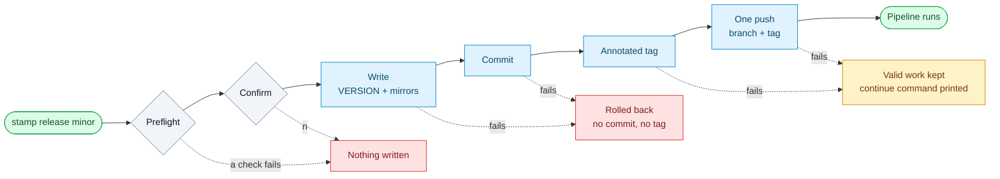

<div align="center">

<h1 align="center">stamp</h1>

**Cut the release on your machine. Let CI do the boring half.**

One command sets the version, writes it everywhere the project keeps it, checks that git is
in a fit state, commits, tags, and pushes the branch and the tag together. Pushing the tag
is what wakes up your pipeline — and by then the version is already decided, committed and
immutable.

*No version guessing in YAML. No half-finished releases. No four-step checklist in a
RELEASE.md nobody reads.*

[](https://github.com/p-arndt/stamp/actions/workflows/ci.yml)
[](https://github.com/p-arndt/stamp/actions/workflows/release.yml)
[](go.mod)
[](#-install)
[](#%EF%B8%8F-configuration)

[Supported](#-what-it-supports) · [Install](#-install) · [Commands](#-commands) · [How a release runs](#-how-a-release-runs) · [Checks](#-checks) · [Configuration](#%EF%B8%8F-configuration) · [CI](#-the-ci-side)

</div>

---

<p align="center">
  
</p>

<sub>`VERSION` is the source of truth here and `package.json` is a mirror, so both are bumped
in one commit. Everything on screen is a real release of a throwaway repository built by
[demo/setup.sh](demo/setup.sh) — re-record it yourself with `just demo`.</sub>

## 📦 What it supports

| | |
| --- | --- |
| **Version sources** | A plain text file (`VERSION`) · a JSON field (`package.json`, or any file and field) |
| **Mirrors** | Any number of further locations, of either kind, bumped in the same commit |
| **Version formats** | Strict semver, including pre-releases (`1.0.0-beta.1`) and build metadata |
| **Bumps** | `patch` · `minor` · `major` · `final` · any explicit version |
| **Pre-releases** | `stamp prerelease minor` opens a `beta` series and walks it: `-beta.1`, `-beta.2`, … |
| **Tag styles** | `v0.5.0`, `0.5.0`, or whatever your template renders |
| **Detected without config** | `VERSION` file · `package.json` |
| **File formatting** | Preserved byte for byte apart from the version literal — tabs stay tabs, key order stays put, the diff is one line |
| **Platforms** | Windows · macOS · Linux, amd64 and arm64, static binaries |
| **Needs** | The `git` binary. Nothing else. |
| **Not supported** | `Cargo.toml` / TOML sources · workspace fan-out (list the paths as mirrors) · running your tests |

## 📥 Install

Grab the archive for your platform from the [latest release](https://github.com/p-arndt/stamp/releases/latest) and put the binary on your `PATH`:

```bash
# macOS (Apple silicon) — swap in darwin_amd64, linux_amd64 or linux_arm64 as needed
curl -sSL https://github.com/p-arndt/stamp/releases/latest/download/stamp_<version>_darwin_arm64.tar.gz \
  | tar -xz -C ~/.local/bin stamp
```

Windows ships a `.zip` holding `stamp.exe`. Every archive is one static binary with no
dependencies, and each release carries a `stamp_<version>_checksums.txt`.

From source, with Go and [just](https://github.com/casey/just): `just install`.

### Staying current

A release binary keeps itself up to date. `stamp self-update` downloads the archive for
your platform, verifies its SHA-256 against the release's checksums file, and swaps the
running binary only if that matches — an unverified download is never installed. Use
`stamp check-update` to look without upgrading.

Every command also prints a one-line hint on **stderr** when a newer version is known,
at most one network check per day and cached in your config directory. It is stderr and
never stdout, so `stamp current` stays safe in a shell substitution. Silence it with
`STAMP_NO_UPDATE_CHECK=1`. Source builds report themselves as `dev` and never check or
self-update — there is nothing to compare a `go build` against.

## 📟 Commands

| Command | What it does |
| --- | --- |
| `stamp release <patch\|minor\|major\|final\|x.y.z>` | The whole release: resolve, check, write, commit, tag, push. `final` promotes a pre-release to the release it was for, dropping the pre-release and bumping nothing. |
| `stamp prerelease [patch\|minor\|major]` | The same, cut as a pre-release: `1.2.3` → `1.3.0-beta.1`. Bare, it cuts the next candidate of the series already running. |
| `stamp set <patch\|minor\|major\|final\|x.y.z>` | Write the version files only, no git. May also go backwards — it is the correction command. |
| `stamp current` | Print the current version bare on stdout, for scripts and justfiles. |
| `stamp verify --tag <tag>` | CI-side: does this tag match the committed version? Non-zero if not. |
| `stamp check-update` | Report whether a newer stamp has been released. |
| `stamp self-update` | Replace this binary with the latest release, once its checksum verifies. |

| Flag for `release` and `prerelease` | Effect |
| --- | --- |
| `--dry-run` | Print the plan and the checks, change nothing. |
| `--no-push` | Write, commit and tag locally; print the push command for later. |
| `--no-fetch` | Skip the network checks. Useful offline; the remote state is then unverified. |
| `--branch <name>` | Release from this branch instead of the configured one. |
| `-y`, `--yes` | Skip the confirmation prompt. Required in a non-interactive shell — stamp never releases on an unanswered prompt. |
| `--type <id>` | `prerelease` only: the identifier of the series — `beta`, `rc`, `alpha`, anything semver accepts. |

Flags may come before or after the version: `stamp release minor --dry-run` works.

### Pre-releases

`stamp prerelease` takes the same bump keyword as `release`, but reads it as *the smallest
escalation the coming stable release stands for*. As long as that target version has not
been reached, repeating the command only walks the counter — the base stays put, because a
version that was never released has nothing to bump past:

```
$ stamp prerelease minor      1.2.3        → 1.3.0-beta.1
$ stamp prerelease            1.3.0-beta.1 → 1.3.0-beta.2   # same target, next candidate
$ stamp prerelease --type rc  1.3.0-beta.2 → 1.3.0-rc.1     # new series, counter restarts
$ stamp prerelease major      1.3.0-rc.1   → 2.0.0-beta.1   # larger bump, new base
$ stamp release final         1.3.0-rc.1   → 1.3.0          # promoted, pre-release dropped
```

The bump says which release the series is being cut *for*, so it is only needed to open a
series or to move it to a higher one — inside a running series all three keywords resolve
to the same next candidate, and a bare `stamp prerelease` says so. Off a stable version it
is required: nothing else tells stamp whether `1.2.3` is heading for `1.2.4` or `2.0.0`. Every step is a normal release — commit, annotated tag, one push — and the
tag carries the pre-release (`v1.3.0-beta.1`), so a pipeline can tell a candidate from a
release by the tag alone.

Without `--type` stamp stays in the series the current version is already in, so walking an
`rc` series does not need the flag repeated. Only a *new* series takes its identifier from
`release.prerelease` in `.stamp.yml`, and from `beta` when that is unset. Going backwards
inside a series (`rc.1` → `beta.1`) is lower in semver and fails the preflight like any
other downgrade.

There is deliberately **no `--no-commit`**: a tag without its version commit makes the
repository state ambiguous, and the whole point is that the tag and the committed version
always agree.

## 🧭 How a release runs



**Everything checkable happens before anything is written**, so the ordinary failure leaves
nothing to undo. Every later failure has a defined resting place:

| Failed at | What stamp does |
| --- | --- |
| Writing a file | Restores every file it had already written. No commit, no tag, nothing pushed. |
| Committing | Unstages, then restores the files. Same clean end state. |
| Creating the tag | Keeps the commit — it is valid on its own — and prints the tag and push commands to continue with. |
| Pushing | Rolls nothing back. Commit and tag are valid locally; prints the retry command, and the undo command if you would rather. |

There is no `git reset --hard` anywhere in stamp. If a push half-succeeded, throwing away
local history is the last thing you want.

## ✅ Checks

| Check | Why it exists |
| --- | --- |
| Version goes forwards | A release that lowers the version breaks every consumer's update logic. Equal is allowed — then stamp writes nothing and tags HEAD, which is the first-release case. |
| Mirrors agree with the source | A drifted mirror means someone bumped one place by hand. Overwriting it would hide that. |
| On the release branch | Default `main`. A release cut from a feature branch tags a commit that will be rewritten. |
| Working tree clean | Untracked files included, so "clean" means what `git status` means. The release commit must hold only the version bump. |
| Not behind the remote | Otherwise the tag names an already-outdated commit. Needs a `git fetch`; skip it with `--no-fetch`. |
| Tag does not exist | Locally and on the remote. Reusing a tag silently changes what a published version means. |

Two situations are reported with a `-` rather than failing: a branch with no upstream yet
(the first push creates it), and the remote checks under `--no-fetch`.

**Tests are not stamp's job.** There is no `checks:` block and no `--check` flag — your
pipeline already tests before it publishes, and a release tool that shells out to your test
suite is a release tool that takes eight minutes and fails for reasons unrelated to
releasing.

A failed preflight lists every problem at once, with the fix in the same line, so you fix
them in one go rather than one release attempt at a time:

```console
$ stamp release minor

Checks:
  ✓ 0.6.0 is newer than 0.5.0
  ✗ on branch main — HEAD is on feature — check out main, set release.branch in .stamp.yml, or pass --branch feature
  ✗ working tree clean — 1 uncommitted change(s) — the release commit must hold only the version bump
  - branch up to date with the remote — feature has no upstream yet — the push will create it

error: preflight failed — nothing was changed
```

And an abort says what it undid, and what never happened:

```console
$ stamp release minor

  updated VERSION

error: writing package.json: open /…/package.json: permission denied

Release aborted.
Restored:
  VERSION → 0.5.0
No commit created.
No tag created.
Nothing pushed.
```

## ⚙️ Configuration

Optional. Without a `.stamp.yml`:

| | Default |
| --- | --- |
| Version source | `VERSION` if present, otherwise `package.json`'s `version` field |
| Branch | `main` |
| Remote | `origin` |
| Tag | `v{{ version }}` |
| Commit | `release: {{ tag }}` |
| Push | yes |
| Pre-release identifier | `beta` |

Everything your project does differently goes in `.stamp.yml` in the repository root:

```yaml
project:
  name: hop                     # shown in the output; defaults to the directory name

version:
  source:
    type: file                  # file | json
    path: VERSION

  mirrors:                      # kept in sync with the source, all in one commit
    - type: json
      path: package.json
      field: version            # optional, defaults to "version"

release:
  branch: main
  remote: origin
  tag: "v{{ version }}"         # "{{ version }}" for tags without a v prefix
  commit: "release: {{ tag }}"
  push: true
  prerelease: beta              # identifier for `stamp prerelease`; --type overrides it
```

A Node project, where `package.json` *is* the source of truth:

```yaml
version:
  source:
    type: json
    path: package.json
```

Templates take `{{ version }}` in the tag, and `{{ version }}` or `{{ tag }}` in the commit
message; inner spaces are optional. A placeholder typo, a template with no placeholder at
all, or an unknown key anywhere in the file is a config error — not a tag literally named
`v{{ vesion }}`.

## 🤖 The CI side

```mermaid
flowchart LR
    subgraph LOCAL["stamp — the controller"]
        direction TB
        V["set the version"] --> C["check"] --> K["commit"] --> T["tag"] --> P["push"]
    end

    HANDOFF{{"tag v0.5.0"}}

    subgraph REMOTE["GitHub Action — the worker"]
        direction TB
        VER["validate the tag"] --> TEST["test"] --> X["cross-compile"] --> A["archives + checksums"] --> REL["changelog + release"]
    end

    P ==> HANDOFF ==> VER

    classDef local fill:#e0f2fe,stroke:#0284c7,color:#0c4a6e
    classDef remote fill:#f3e8ff,stroke:#9333ea,color:#4c1d95
    classDef hand fill:#dcfce7,stroke:#16a34a,color:#14532d
    class V,C,K,T,P local
    class VER,TEST,X,A,REL remote
    class HANDOFF hand
    style LOCAL fill:#f8fafc,stroke:#cbd5e1,color:#334155
    style REMOTE fill:#fdfaff,stroke:#e9d5ff,color:#334155
```



The pipeline never decides a version. Its first job is to confirm that the tag agrees with
the version committed in the repository:

```yaml
on:
  push:
    tags: ['v*']

jobs:
  verify:
    runs-on: ubuntu-latest
    steps:
      - uses: actions/checkout@v7
      - run: curl -sSL https://github.com/p-arndt/stamp/releases/latest/download/stamp_0.1.0_linux_amd64.tar.gz | tar -xz -C /usr/local/bin stamp
      - run: stamp verify --tag "$GITHUB_REF_NAME"
```

`verify` compares *forwards* — version → tag — instead of stripping a prefix off the tag:
reversing a template is ambiguous, rendering one is not. It checks every mirror too, so the
published artifacts can never disagree about their own version.

This repository's own [release.yml](.github/workflows/release.yml) is a working example — it
verifies with `go run . verify`, so stamp checks its own tag on the way out.
